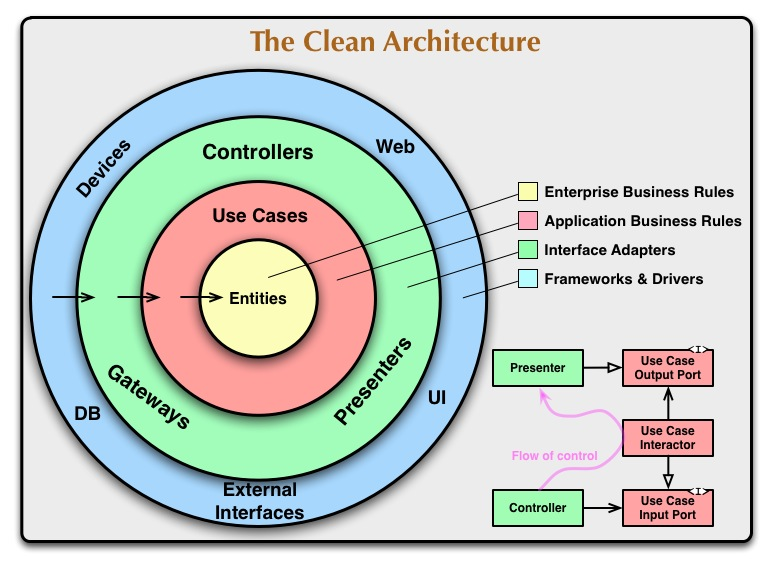

The Script folder follows the Clean Architecture organization,

the names of the layers have been renamed as:

 A	=	Enterprise Bussines Rules (Entity)
 B	=	Application Bussines Rules (UseCase)
 C	=	Interface Adapters (Controller, Gateways, Presenters)
 D	=	Frameworks & Drivers (UI, DB, Devices, Web, External Interfaces)
 
 
To enforce the use of this pattern the folders include their own Assembly Definition.
